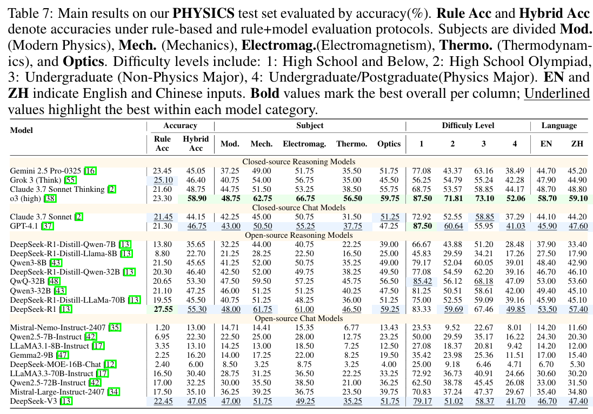

# PHYSICS
<p align="center">        </p>

<p align="center">
  📄 <a href="https://arxiv.org/abs/2506.00022" target="_blank">Paper</a> &nbsp; | &nbsp;
  🤗 <a href="https://huggingface.co/datasets/desimfj/PHYSICS" target="_blank">Hugging Face</a> &nbsp; | &nbsp;
  ⏬ <a href="https://drive.google.com/file/d/1QFGA_CTAn7_NNyBWaybvRcwdTjfrtZZF/view?usp=drive_link" target="_blank">Data</a>
</p>

This repo contains the code for the paper [Scaling Physical Reasoning with the PHYSICS Dataset](https://arxiv.org/abs/2506.00022).

## Overview

We introduce a large-scale, high-quality, and widely challenging PHYSICS dataset for training and evaluation, along with a Rule+Model assessment framework, providing a novel solution for enhancing the physics reasoning capabilities of large models.

<p align="center"></p>

## Data process

We  introduce a dataset split 7:1 into a 14,568-sample training set with reasoning paths generated by strong models, and a 2,000-sample test set balanced in difficulty and topics.

① **Scale and Quality**: We curated and cleaned 8,284 high-quality physics problems from over 100 textbooks, later expanded to 16,568 through bilingual translation. Multiple quality checks, including model correction and expert review, ensure accuracy and reliability.

②**Multidimensional Coverage**: The dataset spans five domains — mechanics, electromagnetism, thermodynamics, optics, and modern physics — and four difficulty levels ranging from high school to graduate studies: high school, competition-level, non-physics undergraduate, and physics-focused undergraduate/graduate .

<p align="center"></p>

The field names in the files are explained as follows:

- **id**: A unique identifier for each original data entry. Both translated and original data share the same id.
- **question**: The physics problem.
- **solution**: The step-by-step solution process extracted from the data source.
- **answer**: The correct answer to the question. Each sub-question's answer is stored in a list.
- **answer_type**: The type of each answer, which can be one of the following: *Interval*, *Expression*, *Equation*, *True/False*, *Multiple Choice*, *Numerical*, *Open-End*.
- **language**: The language of the question, either *Chinese (zh)* or *English (en)*.
- **domain**: The physics domain the question belongs to, including *Modern Physics*, *Mechanics*, *Electromagnetism*, *Thermodynamics*, and *Optics*.
- **difficulty**: The difficulty level of the question, categorized as *High School and Below*, *High School Olympiad*, *Undergraduate (Non-Physics Major)*, or *Undergraduate/Postgraduate (Physics Major)*.
- **translate**: Whether the question was obtained via translation. *true* means the question was translated; *false* indicates it is original data.
- **reason_path** (only in the training set): The detailed reasoning path generated by QwQ-32B for questions, provided to facilitate model training.

## Experiments

### Eval

We take both open- and closed-source LLMs into consideration. Such as GPT-o3, Gemini-Pro-2.5, Grok3, DeepSeek-r1.

We evaluate the models in a zero-shot setting, and the prompt template is shown as follows.

```
Prompt:
""" "Below is an open-ended problem in Physics. Please answer this problem adhering to the following rules:\n"
   "1. Please use LaTeX format to represent the variables and formulas used in the solution process and results.\n"
    "2. Please put the final answer(s) in \\boxed{}, note that the unit of the answer should not be included in \\boxed{}.\n"
    "3. If there are multiple final answers, please seperated them by commas in \\boxed{}, e.g., \\boxed{answer 1, answer 2}.\n"
     "Problem:{{prompt}}"""
```

The key results are as follows:

\- o3 only achieves 58.9%. DeepSeek-R1 gets  55.30%. 

\- A huge gap between closed- and open-source models.

\- The challenge lies more on some certain subjects such as Thermodynamics and Modern Physics. 

<p align="center"></p>

## Contact

If interested in our work, please contact us at:

\- Shenghe Zheng: shenghez.zheng@gmail.com

## Citation

```
@article{zheng2025scaling,
  title={Scaling Physical Reasoning with the PHYSICS Dataset},
  author={Zheng, Shenghe and Cheng, Qianjia and Yao, Junchi and Wu, Mengsong and Ding, Ning and Cheng, Yu and Hu, Shuyue and Bai, Lei and Zhou, Dongzhan and Cui, Ganqu and others},
  journal={arXiv preprint arXiv:2506.00022},
  year={2025}
}
```

